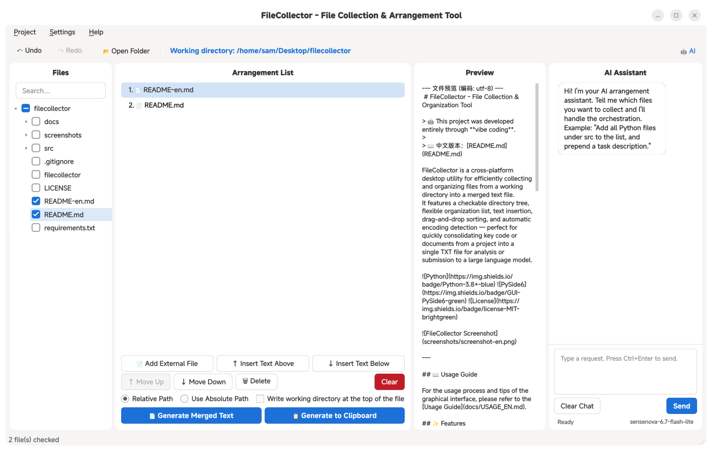

# FileCollector - File Collection & Organization Tool

<div align="center">
  
</div>

> This project was developed entirely through **vibe coding**.

[中文版](README.md)

FileCollector is a cross-platform desktop utility for efficiently collecting and organizing files from a working directory into a merged text file.  
It features a checkable directory tree, flexible organization list, text insertion, and automatic encoding detection — perfect for quickly consolidating key code or documents from a project into a single TXT file for analysis or submission to a large language model. The built-in AI assistant sidebar supports natural language-driven file exploration, selection, and orchestration.

    



---

## Usage Guide

For the usage process and tips of the graphical interface, please refer to the [Usage Guide](docs/USAGE_EN.md).

## Features

- **Command-Line Mode (CLI)**: Supports all core operations via terminal commands, ideal for scripting and automation.
- **MCP Service**: Packaged as an MCP (Model Context Protocol) service, directly callable by coding tools like Cursor, VS Code + Copilot.
- **Binary File Pre-conversion**: Automatically converts images, PDFs, Office documents, and other binary files into Markdown format, with caching and configurable extensions.
- **Built-in AI Assistant Panel**: A sidebar chat interface inside the GUI — the AI can directly drive file-tree exploration, file selection, orchestration, and merged-text generation.
- **Progressive Experience**: Seamless integration of CLI and GUI — after AI-driven exploration in the background, the graphical interface is always available for manual adjustment.
- **Lazy-loaded Directory Tree**: Automatically displays an expandable file tree when opening a folder, with easy file checkbox selection.
- **Visual Organization List**: Checked files automatically appear in the list, freely reorderable via drag-and-drop, move up/down, or delete.
- **Custom Text Insertion**: Insert explanatory text at any position, double-click to edit.
- **Instant Preview**: Select a list item to preview file content or full text in the right panel.
- **External File Support**: Manually add external files using absolute paths.
- **Smart Encoding Detection**: Automatically identifies `utf-8`, `gbk`, and other encodings for seamless Chinese file handling.
- **Flexible Output**: Choose absolute or relative paths, with optional working directory annotation at file header.
- **Project Save/Load**: Save current workspace state as `.fcol` and restore it with one click.
- **Cross-Platform**: Built on Flet, supporting Windows, macOS, and Linux.

---

## Why Use This Tool?

1. **Solving the Context Dilemma in Coding Tools**: In coding tools, models need to make numerous tool calls to explore the workspace, which can easily get sidetracked by irrelevant files and lose focus. Large projects are prone to context compression. Additionally, the large system prompts in coding tools consume significant tokens. Use this tool to manually select important files, then pass the curated context to a web-side model (with relatively lighter system prompts) for bug analysis and other deep reasoning tasks, maximizing model reasoning performance.

2. **Cost Control**: Web-side models are mostly free (or come with credits), aren't they?

---

## Installation & Usage

### GNOME Users

If you are using the **GNOME desktop environment**, we recommend using the GNOME-optimized version for a more native integration experience:

[filecollector-gnome](https://github.com/Sam-Fic/filecollector-gnome)

This version is adapted and optimized for GNOME, including:

- Native GNOME-style interface
- Better desktop integration and interaction experience
- Special optimizations for the GNOME environment

### Run from Source

**Requirements**: Python 3.8+.

1. Clone the repository
   ```bash
   git clone https://github.com/Sam-Fic/FileCollector.git
   cd FileCollector
   ```
2. Install dependencies
   ```bash
   pip install -r requirements.txt
   ```
   > Note: The `keyring` library provides system-level keyring storage for secure API Key management across platforms (Linux: GNOME Keyring, macOS: Keychain, Windows: Credential Locker).
3. Run the program
   ```bash
   cd src
   python -m filecollector
   ```

Alternatively, use the one-click launcher in the project root to start the Flet GUI directly (no `cd` needed):
   ```bash
   ./filecollector
   ```

<!-- ### Download Pre-built Packages (Recommended)

Visit the [Releases](https://github.com/Sam-Fic/FileCollector/releases) page to download the executable for your OS:

- `FileCollector-Windows.zip`
- `FileCollector-macOS.zip`
- `FileCollector-Linux.AppImage`
 -->

---

## Project Structure

```
filecollector                  # One-click launcher for Flet GUI (bash)
requirements.txt               # Python dependency list
LICENSE                        # MIT license
README.md / README-en.md       # Project docs (Chinese / English)
icons/                         # Application icon
│   ├── filecollector.svg
│   ├── filecollector.png
│   └── filecollector.ico
screenshots/                   # Screenshots for README
docs/                          # Usage guide + illustrations
│   ├── USAGE.md               # GUI usage guide (Chinese)
│   ├── USAGE_EN.md            # GUI usage guide (English)
│   └── images/                # Documentation images
└── src/
    ├── FileCollector.spec         # PyInstaller build config
    └── filecollector/             # Core Python package
        ├── __init__.py            # Package declaration, exports ItemData / FileCollectorEngine
        ├── __main__.py            # python -m filecollector entry, CLI/GUI dispatch
        ├── models.py              # Data model (ItemData: file/text items)
        ├── utils.py               # Utility functions (encoding detection, safe read)
        ├── engine.py              # Business engine (all core logic, Qt-free)
        ├── cli.py                 # CLI mode (sequential argument parsing and execution)
        ├── config.py              # Configuration management (settings.json read/write)
        ├── ipc.py                 # Inter-process communication (CLI-GUI single-instance coordination)
        ├── i18n.py                # Internationalization support
        ├── ai_client.py           # AI assistant backend (OpenAI-compatible API + Function Calling)
        ├── binary_converter.py    # Binary file to Base64 conversion (image scaling + document-to-PDF rendering)
        ├── multimodal_ai_client.py # Vision-Language Model (VLM) client (sends Base64 images to vision models)
        ├── preprocess_cache.py    # Preprocessing cache (SHA256 hash + manifest management)
        ├── locales/               # Locale directories (en / zh_CN)
        └── gui_flet/              # Flet cross-platform GUI implementation
            ├── __init__.py
            ├── main_view.py       # Main view (Flet entry point)
            ├── file_tree.py       # File tree widget (Flet version)
            ├── arrangement_list.py # Visual organization list (Flet version)
            ├── preview_panel.py   # Preview panel (Flet version)
            ├── ai_panel.py        # AI assistant chat panel (Flet version)
            ├── ai_settings_dialog.py # AI assistant configuration dialog (Flet version)
            ├── dialogs.py         # Text edit dialog (Flet version)
            ├── snack.py           # Lightweight toast notification (Flet version)
            └── undo.py            # Undo/redo support (Flet version)
```

---

## User Guide

For the complete GUI workflow (opening directories, checking files, organizing the list, previewing, exporting, etc.), please refer to the [GUI Usage Guide](docs/USAGE_EN.md).

---

## CLI Mode

FileCollector comes with a built-in command-line mode that lets you perform all core operations directly from the terminal, making it ideal for scripting and automation.

### Usage

Run `filecollector` with CLI arguments to enter command-line mode. If no CLI arguments are detected, the GUI launches normally.

```bash
filecollector [options...]
```

### Command Reference

| Option               | Description                                    |
| -------------------- | ---------------------------------------------- |
| `--work-dir DIR`     | Set working directory                          |
| `--select-file PATH` | Add file to the organization list (repeatable) |
| `--add-text "TEXT"`  | Add custom text (repeatable)                   |
| `--move FROM TO`     | Move item at index FROM to index TO            |
| `--remove INDEX`     | Remove item at INDEX                           |
| `--clear`            | Clear the organization list                    |
| `--list-items`       | List current organization items                |
| `--export PATH`      | Export merged text to file                     |
| `--absolute`         | Use absolute paths                             |
| `--header`           | Add header with working directory path         |
| `--load FILE`        | Load state from project file                   |
| `--save FILE`        | Save current state to project file             |
| `--gui`              | Open GUI after initializing with CLI arguments |
| `--help`, `-h`       | Show help message                              |

### Workflow Examples

**Build and export:**

```bash
filecollector --work-dir ./project \
    --select-file src/main.vala \
    --select-file src/utils/helper.vala \
    --add-text "=== Config files below ===" \
    --select-file config.ini \
    --move 3 2 \
    --header \
    --export output.txt
```

**Export from a project file:**

```bash
filecollector --load my.fcol --export output.txt
```

**Build and save project (for later use in GUI):**

```bash
filecollector --work-dir ./project \
    --select-file file1.txt --select-file file2.txt \
    --save my.fcol
```

**View the organization list:**

```bash
filecollector --load my.fcol --list-items
```

**Load project and open GUI for manual adjustment:**

```bash
filecollector --load my.fcol --gui
```

**Initialize state with CLI args then open GUI:**

```bash
filecollector --work-dir ./project --select-file src/main.vala --gui
```

> CLI mode and GUI mode share the same data model and business logic — `.fcol` files are fully interchangeable between them. Add `--gui` to pop up the graphical interface after initializing state via CLI arguments, enabling seamless switching between automation and manual review.

---

## MCP (Model Context Protocol) Service

FileCollector is already packaged as an MCP service. Large language models in coding tools (such as Cursor, VS Code + Copilot) can now directly invoke it to complete the following workflow:

1. The user gives the model an instruction (e.g., "This project has an xx issue, help me find related files and export them as a single TXT file").
2. The model explores files and uses this tool to check and select key files related to the issue.
3. The model inserts the instruction (the problem to solve) at an appropriate position.
4. The tool generates a structured TXT file.
5. The user uploads this TXT file to a web-side LLM (like Claude, ChatGPT, etc.) for deep reasoning and problem-solving.
6. Based on the model's response, the user can execute actual problem-solving operations using low-cost models in the coding tool.

This design separates **file exploration and code selection** (handled by the model in the coding tool) from **complex reasoning** (handled by the web-side model), leveraging the strengths of different models while keeping costs manageable.

> See [filecollector-mcp-server](https://github.com/Sam-Fic/filecollector-mcp-server) for details, installation, and usage.

---

## Built-in AI Assistant Panel

FileCollector also ships with a **sidebar AI assistant** that lets you drive the whole workflow with natural language — no coding tool or MCP service required. Click the **AI** button at the top-right of the toolbar to expand or collapse it.

### Key Capabilities

- **Natural-language orchestration**: Tell the AI "add every Python file under `src` to the list, and prepend a task description" — the AI will call the right tools to check files, insert text, reorder items, etc.
- **File exploration & reading**: The AI can browse the working-directory tree and read file contents on demand to make informed decisions.
- **Real-time feedback**: Every tool invocation (set work directory, add files, read files, reorder, ...) is shown as an expandable tool card so you can audit each step.
- **Multi-turn conversation**: The AI keeps the conversation history, so you can iteratively refine the orchestration until you are happy.
- **Live GUI sync**: Whenever the AI modifies the orchestration list, the middle panel updates immediately and you can take over manually at any moment.

### Supported Tools (Function Calling)

The AI interacts with the GUI engine through these 10 tools (sharing the same semantics as the CLI / MCP paths):

| Tool               | Purpose                                            |
| ------------------ | -------------------------------------------------- |
| `set_work_dir`     | Switch the working directory                       |
| `add_files`        | Batch-add files to the orchestration list          |
| `add_text`         | Insert a custom text block into the list           |
| `remove_item`      | Delete a list item by its id                       |
| `move_item`        | Reorder a list item                                |
| `clear_items`      | Empty the entire orchestration list                |
| `set_use_absolute` | Toggle absolute-path / relative-path mode          |
| `set_show_header`  | Toggle the working-directory header in exports     |
| `list_files`       | Browse the working directory (recursive, filtered) |
| `read_file`        | Read a file's text content (with line numbers)     |

### Binary File Pre-conversion (Vision-Language Model VLM)

FileCollector can automatically convert binary files into Markdown format, eliminating manual preprocessing.

- **Image files** (PNG, JPEG, WebP, BMP, TIFF, etc.): Automatically scaled to a maximum of 2048px and encoded as Base64, then sent directly to a VLM for text extraction or content understanding.
- **Document files** (PDF, DOCX, PPTX, XLSX, ODT, ODP, ODS, RTF, etc.): First converted to PDF via LibreOffice, then rendered as image sequences via `pdftoppm`, and sent page-by-page to a VLM.
- **Conversion cache**: Converted results are cached in the `.filecollector_cache/` directory under the working directory. The system uses SHA256 file hashes to determine whether re-conversion is needed, avoiding redundant processing.
- **Configurable extensions**: In the AI Settings dialog, you can customize the list of binary file extensions allowed for VLM processing. Changes automatically trigger re-evaluation of the preprocessing queue.

### Vision-Language Model (VLM) Configuration

Open **AI Settings** (Menu → AI Settings) and switch to the **VLM** tab:

1. Check **Enable Vision-Language Model (VLM)**.
2. Enter the **API Base URL** (compatible with OpenAI Chat Completions protocol, e.g. `https://api.openai.com/v1`).
3. Enter the **API Key** and **Model Name** (e.g. `gpt-4o`, `claude-3-opus`, or other vision-capable models).
4. (Optional) Customize the **Preprocessing Prompt** — leave empty to use the built-in prompt.
5. Click **Test Connection** to verify the configuration, then save.

### Configuration

Open **Settings → AI Settings**:

1. Check **Enable AI Assistant**.
2. Fill in the **API base URL** (any OpenAI Chat-Completions-compatible endpoint, e.g. `https://api.openai.com/v1`, Azure OpenAI, a self-hosted gateway, or local models like Ollama).
3. Fill in the **API key** and **model name** (e.g. `gpt-4o-mini`, `deepseek-chat`).
4. (Optional) Override the **system prompt** — leave empty to use the built-in engineering-orchestration prompt.
5. Click **Test Connection** to verify the setup, then save.

All settings live in the `ai` field of `settings.json`. **The API key is stored locally only** and never sent to any remote.

### Usage Examples

> Please add every file in this project that is related to the AI sidebar to the orchestration list, and prepend a descriptive text block.

Expected tool sequence: `list_files` to locate the AI sidebar files (`ai_panel.py`, `ai_client.py`, `ai_markdown.py`, `ai_settings_dialog.py`) → `add_files` to batch-insert them into the orchestration list → `add_text` to prepend the description.

> Export to `output.txt` using relative paths, and include the working-directory header.

Expected tool sequence: `set_use_absolute(False)` and `set_show_header(True)`, then trigger the GUI export flow.

### Implementation Notes

- **Backend**: `ai_client.py` uses stdlib `urllib.request` to talk to any OpenAI-compatible endpoint — **no extra dependencies** like `requests`.
- **Async**: API requests run on a background thread, so the UI never freezes.
- **Styling**: The AI panel renders chat bubbles with Markdown support for headings, lists, code blocks, quotes, tables, etc.
- **Tool-call display**: Every tool the AI triggers is shown as an expandable card (function name + arguments + return value) for full traceability.
- **i18n**: AI prompts are written in English by default to ensure consistent model behavior across UI locales; UI text is localized through the project's built-in `i18n` module.

### Relationship to the MCP Service

| Dimension       | MCP Service                       | Built-in AI Panel                |
| --------------- | --------------------------------- | -------------------------------- |
| Runs in         | Coding tools (Cursor / VS Code)   | The FileCollector GUI itself     |
| Context source  | The project already open in the IDE | AI browses the working directory on demand |
| Best for        | The model helping you while coding | Doing one big file-organization pass on your own |
| API config      | Inherited from the IDE            | Configured independently         |

The two are complementary: the MCP service targets in-IDE "organize while you develop" workflows, while the built-in AI panel targets standalone, systematic file-organization tasks.

---

## Progressive Experience

GUI and CLI combine to deliver a seamless human-AI collaborative workflow:

1. In Cursor, let the large model auto-explore and organize project files via the MCP service.
2. When the generated file list needs manual fine-tuning, run in terminal:
   ```bash
   filecollector --load ~/.config/filecollector/mcp_state.json --gui
   ```
   The `--gui` flag ensures the GUI opens (without it, the CLI commands are executed directly).
3. A graphical interface pops up, showing the model-selected file list. You can continue to check, reorder, and save.
4. Return to Cursor and the model continues with the next steps.

---

## Build Your Own Package

To package as a standalone executable using PyInstaller:

```bash
pip install pyinstaller
cd src && pyinstaller FileCollector.spec
```

Ensure all dependencies (`requirements.txt`) are installed before packaging.

---

## Contributing

This project is in its early stages. Issues and Pull Requests are welcome.

---

## License

This project uses the **MIT License**, see the [LICENSE](LICENSE) file for details.

---

## Acknowledgments

- [Flet](https://flet.dev/) - Cross-platform GUI framework
- [chardet](https://github.com/chardet/chardet) - Encoding detection library
- [markdown-it-py](https://github.com/executablebooks/mdit-py) - Markdown parser for rich text rendering in the AI chat panel
- [Pygments](https://pygments.org/) - Syntax highlighting library for code block coloring in AI chat

Special thanks to [Decembered](https://github.com/Decembered) for contributions and support.
