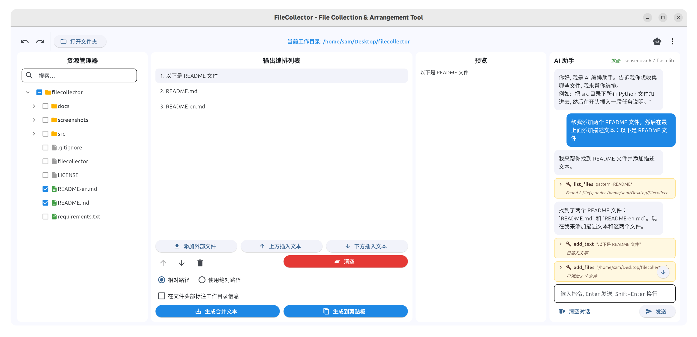

# FileCollector - File Collection & Organization Tool

> 🤖 This project was developed entirely through **vibe coding**.
>
> 📖 中文版本：[README.md](README.md)

FileCollector is a cross-platform desktop utility for efficiently collecting and organizing files from a working directory into a merged text file.  
It features a checkable directory tree, flexible organization list, text insertion, drag-and-drop sorting, and automatic encoding detection — perfect for quickly consolidating key code or documents from a project into a single TXT file for analysis or submission to a large language model.

  



---

## ✨ Features

- 💻 **Command-Line Mode (CLI)**: Supports all core operations via terminal commands, ideal for scripting and automation.
- 🤖 **MCP Service**: Packaged as an MCP (Model Context Protocol) service, directly callable by coding tools like Cursor, VS Code + Copilot.
- 🔄 **Progressive Experience**: Seamless integration of CLI and GUI — after AI-driven exploration in the background, the graphical interface is always available for manual adjustment.
- 📂 **Lazy-loaded Directory Tree**: Automatically displays an expandable file tree when opening a folder, with easy file checkbox selection.
- 📋 **Visual Organization List**: Checked files automatically appear in the list, freely reorderable via drag-and-drop, move up/down, or delete.
- ✏️ **Custom Text Insertion**: Insert explanatory text at any position, double-click to edit.
- 🔍 **Instant Preview**: Select a list item to preview file content or full text in the right panel.
- 🧲 **External File Support**: Manually add external files using absolute paths.
- 🧠 **Smart Encoding Detection**: Automatically identifies `utf-8`, `gbk`, and other encodings for seamless Chinese file handling.
- 📄 **Flexible Output**: Choose absolute or relative paths, with optional working directory annotation at file header.
- 💾 **Project Save/Load**: Save current workspace state as `.project.json` and restore it with one click.
- 🚀 **Cross-Platform**: Built on PySide6, supporting Windows, macOS, and Linux with crisp high-DPI fonts.

---

## 🤔 Why Use This Tool?

1. **Solving the Context Dilemma in Coding Tools**: In coding tools, models need to make numerous tool calls to explore the workspace, which can easily get sidetracked by irrelevant files and lose focus. Large projects are prone to context compression. Additionally, the large system prompts in coding tools consume significant tokens. Use this tool to manually select important files, then pass the curated context to a web-side model (with relatively lighter system prompts) for bug analysis and other deep reasoning tasks, maximizing model reasoning performance.

2. **Cost Control**: Web-side models are mostly free (or come with credits), aren't they?

---

## 🛠️ Installation & Usage

### 🐧 GNOME Users

If you are using the **GNOME desktop environment**, we recommend using the GNOME-optimized version for a more native integration experience:

👉 [filecollector-gnome](https://github.com/Sam-Fic/filecollector-gnome)

This version is adapted and optimized for GNOME, including:
- Native GNOME-style interface
- Better desktop integration and interaction experience
- Special optimizations for the GNOME environment

### Run from Source

**Requirements**: Python 3.8+.

1. Clone the repository
   ```bash
   git clone https://github.com/Sam-Fic/FileCollector.git
   cd FileCollector
   ```
2. Install dependencies
   ```bash
   pip install -r requirements.txt
   ```
3. Run the program
   ```bash
   cd src
   python file_collector.py
   ```

<!-- ### Download Pre-built Packages (Recommended)

Visit the [Releases](https://github.com/Sam-Fic/FileCollector/releases) page to download the executable for your OS:

- `FileCollector-Windows.zip`
- `FileCollector-macOS.zip`
- `FileCollector-Linux.AppImage`
 -->
---

## 📁 Project Structure

```
src/
├── file_collector.py          # Legacy entry point (thin wrapper → delegates to package)
├── FileCollector.spec         # PyInstaller build config
└── filecollector/             # Core Python package
    ├── __init__.py            # Package declaration, exports ItemData / FileCollectorEngine
    ├── __main__.py            # python -m filecollector entry, CLI/GUI dispatch
    ├── models.py              # Data model (ItemData: file/text items)
    ├── utils.py               # Utility functions (encoding detection, safe read)
    ├── engine.py              # Business engine (all core logic, Qt-free)
    ├── cli.py                 # CLI mode (sequential argument parsing and execution)
    └── gui/
        ├── __init__.py
        ├── dialogs.py         # Text edit dialog (TextEditDialog)
        └── main_window.py     # Main window (FileCollectorApp, depends on PySide6)
```

---

## 📖 User Guide

1. **Open Working Directory**  
   Click `📂 Open Folder`, select your project root, and the file tree will appear on the left.
2. **Check Files**  
   Check files in the tree to add them to the organization list in order.
3. **Organize Content**
   - Drag list items to freely reorder;
   - Use `Insert Text ↑/↓` to add comments before or after selected items;
   - Double-click text items to edit;
   - Click `Add External File` to include files outside the working directory.
4. **Preview & Adjust**  
   Select any item to preview the first 50 lines of a file or full text content in the right panel.
5. **Set Output Options**  
   Choose **Relative Path** (recommended) or **Absolute Path**; if using relative paths, you can check "Annotate working directory absolute path at file header" for readability.
6. **Generate TXT**  
   Click `📄 Generate TXT`, choose a save location, and get a merged text file in order.
7. **Save/Restore Workspace**  
   Use `💾 Save Project` to store the current selection and organization as `.project.json`, then restore it later via `📂 Load Project`.

---

## 🖥️ CLI Mode

FileCollector comes with a built-in command-line mode that lets you perform all core operations directly from the terminal, making it ideal for scripting and automation.

### Usage

Run `filecollector` with CLI arguments to enter command-line mode. If no CLI arguments are detected, the GUI launches normally.

```bash
filecollector [options...]
```

### Command Reference

| Option               | Description                                     |
| -------------------- | ----------------------------------------------- |
| `--work-dir DIR`     | Set working directory                           |
| `--select-file PATH` | Add file to the organization list (repeatable)  |
| `--add-text "TEXT"`  | Add custom text (repeatable)                    |
| `--move FROM TO`     | Move item at index FROM to index TO             |
| `--remove INDEX`     | Remove item at INDEX                            |
| `--clear`            | Clear the organization list                     |
| `--list-items`       | List current organization items                 |
| `--export PATH`      | Export merged text to file                      |
| `--absolute`         | Use absolute paths                              |
| `--header`           | Add header with working directory path          |
| `--load FILE`        | Load state from project file                    |
| `--save FILE`        | Save current state to project file              |
| `--help`, `-h`       | Show help message                               |

### Workflow Examples

**Build and export:**

```bash
filecollector --work-dir ./project \
    --select-file src/main.vala \
    --select-file src/utils/helper.vala \
    --add-text "=== Config files below ===" \
    --select-file config.ini \
    --move 3 2 \
    --header \
    --export output.txt
```

**Export from a project file:**

```bash
filecollector --load my.project.json --export output.txt
```

**Build and save project (for later use in GUI):**

```bash
filecollector --work-dir ./project \
    --select-file file1.txt --select-file file2.txt \
    --save my.project.json
```

**View the organization list:**

```bash
filecollector --load my.project.json --list-items
```

> CLI mode and GUI mode share the same data model and business logic — `.project.json` files are fully interchangeable between them.

---

## 🗺️ MCP (Model Context Protocol) Service

FileCollector is already packaged as an MCP service. Large language models in coding tools (such as Cursor, VS Code + Copilot) can now directly invoke it to complete the following workflow:

1. The user gives the model an instruction (e.g., "This project has an xx issue, help me find related files and export them as a single TXT file").
2. The model explores files and uses this tool to check and select key files related to the issue.
3. The model inserts the instruction (the problem to solve) at an appropriate position.
4. The tool generates a structured TXT file.
5. The user uploads this TXT file to a web-side LLM (like Claude, ChatGPT, etc.) for deep reasoning and problem-solving.
6. Based on the model's response, the user can execute actual problem-solving operations using low-cost models in the coding tool.

This design separates **file exploration and code selection** (handled by the model in the coding tool) from **complex reasoning** (handled by the web-side model), leveraging the strengths of different models while keeping costs manageable.

> See [filecollector-mcp-server](https://github.com/Sam-Fic/filecollector-mcp-server) for details, installation, and usage.

---

## 🔄 Progressive Experience

GUI and CLI combine to deliver a seamless human-AI collaborative workflow:

1. In Cursor, let the large model auto-explore and organize project files via the MCP service.
2. When the generated file list needs manual fine-tuning, run in terminal:
   ```bash
   filecollector --load ~/.config/filecollector/mcp_state.json
   ```
3. A graphical interface pops up, showing the model-selected file list. You can continue to check, reorder, and save.
4. Return to Cursor and the model continues with the next steps.

---

## 📦 Build Your Own Package

To package as a standalone executable using PyInstaller:

```bash
pip install pyinstaller
pyinstaller --onefile --windowed --name "FileCollector" file_collector.py
```

Ensure all dependencies (`requirements.txt`) are installed before packaging.

---

## 🤝 Contributing

This project is in its early stages. Issues and Pull Requests are welcome.  

---

## 📄 License

This project uses the **MIT License**, see the [LICENSE](LICENSE) file for details.  

---

## 🙏 Acknowledgments

- [PySide6](https://wiki.qt.io/Qt_for_Python) - Modern GUI framework
- [chardet](https://github.com/chardet/chardet) - Encoding detection library
