# FileCollector 使用说明

本文档详细介绍 FileCollector 图形界面的使用方法，帮助您快速掌握文件的勾选、编排、自定义文本插入以及合并文本导出等核心功能。

> 提示：项目主页与构建说明请参阅 [README.md](../README.md)。本文档仅聚焦 GUI 工作流。

> 本文档界面插图为 GNOME 版本

## 目录

- [工作流程](#工作流程)
  - [步骤 1：打开工作目录](#步骤-1打开工作目录)
  - [步骤 2：勾选需要编排的文件](#步骤-2勾选需要编排的文件)
  - [步骤 3：调整输出编排列表](#步骤-3调整输出编排列表)
  - [步骤 4：预览合并文本的输出格式](#步骤-4预览合并文本的输出格式)
  - [步骤 5：导出合并 TXT 文本](#步骤-5导出合并-txt-文本)
- [使用 Tips](#使用Tips)
  - [1. 快速预览文件内容](#1-快速预览文件内容)
  - [2. 常用语管理](#2-常用语管理)
  - [3. 自定义面板布局](#3-自定义面板布局)
  - [4. 项目的保存与打开](#4-项目的保存与打开)
  - [5. 编辑已插入的文本](#5-编辑已插入的文本)
  - [6. 文件搜索](#6-文件搜索)

## 工作流程

### 步骤 1：打开工作目录

点击左上角的「打开工作目录」按钮，在弹出的目录选择对话框中指定项目根目录。该目录将作为后续操作的根范围：所有相对路径计算、文件搜索与勾选行为均以此目录为基准。

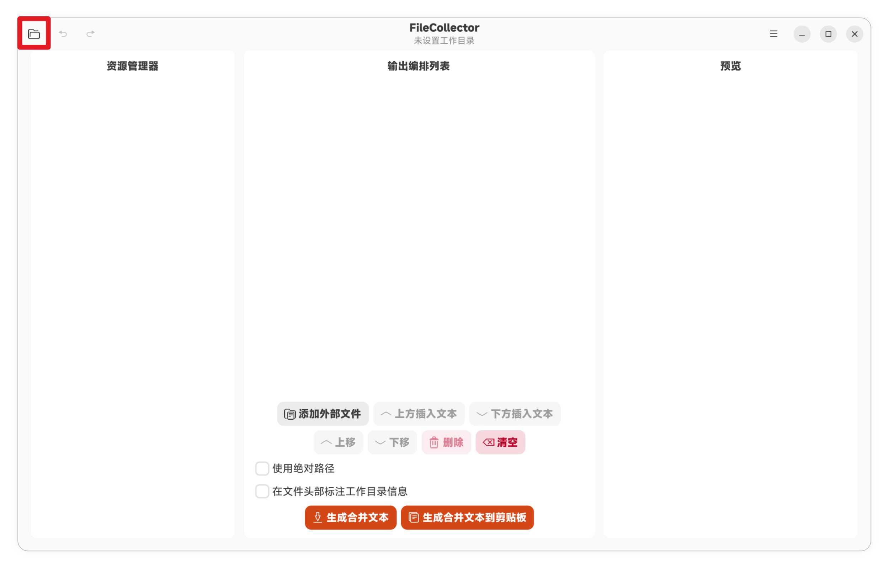

### 步骤 2：勾选需要编排的文件

在左侧资源管理器中浏览目录树，并勾选需要纳入合并文本的文件：

- **复选框**：单击文件夹左侧的复选框，可一次性选中或取消该文件夹内的所有文件。
- **箭头**：单击文件夹左侧的箭头，可展开或折叠该文件夹的子级内容，便于在大型项目中导航。

选中的文件会立即同步到右侧的「输出编排列表」。

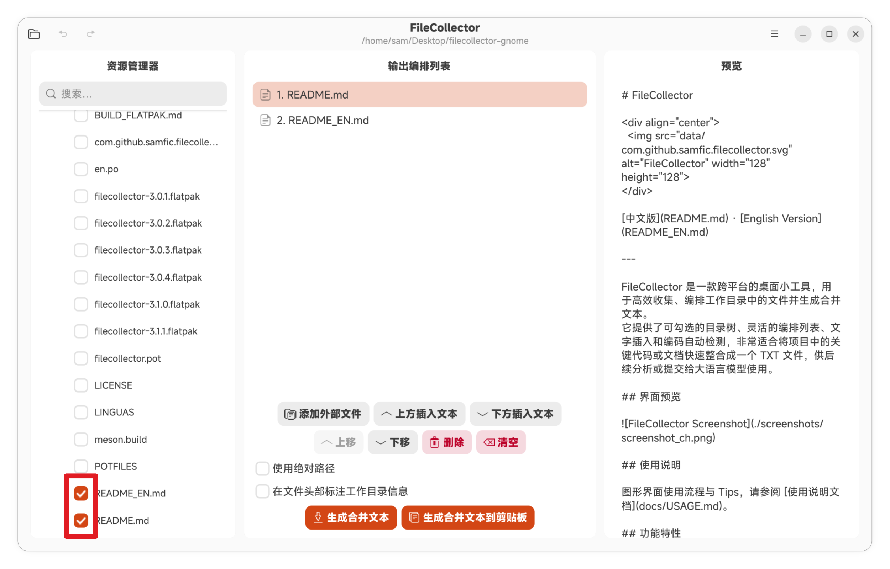

### 步骤 3：调整输出编排列表

点击输出编排列表中的任意一项后，可以使用下方的功能按钮或对应的键盘快捷键对该项进行操作：

- **移动位置**：将选中项在列表中上移或下移，调整合并顺序。
- **插入文本**：在选中项的「上方」或「下方」插入自定义文本段落，便于在文件之间添加分隔说明、问题描述或注释。
- **删除**：从编排列表中移除当前项。
- **清空**：一键清空整个编排列表，重新开始编排。

通过上述操作，您可以灵活地组织最终合并文本的结构与顺序。

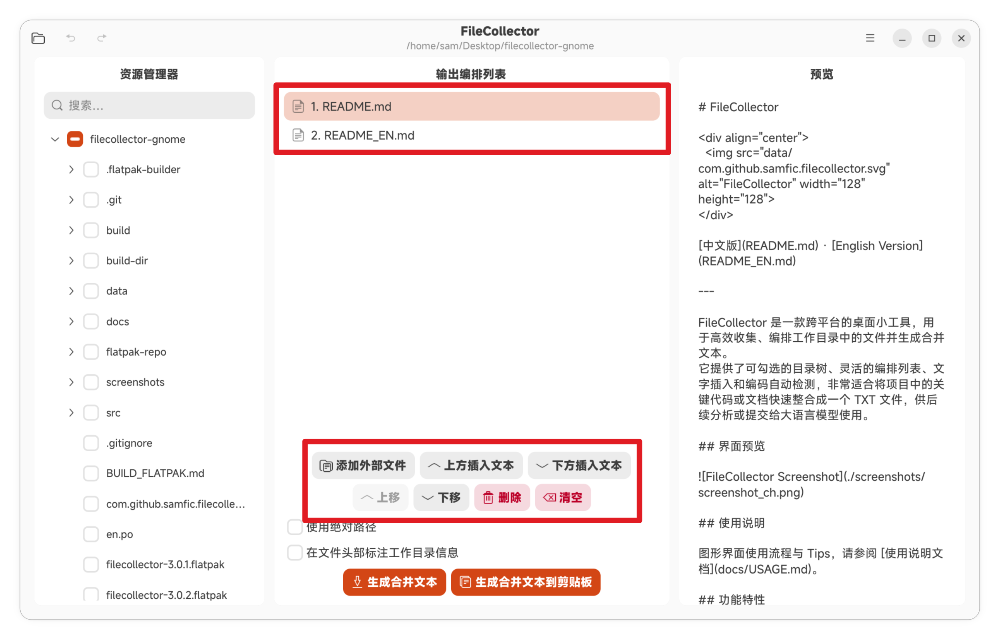

### 步骤 4：预览合并文本的输出格式

合并后的文本将严格按照输出编排列表中的顺序进行整合，并遵循以下路径标识规则：

- **工作区内的文件**：在文件正文的上方显示文件路径。可通过界面下方的选项，在「绝对路径」与「相对路径（相对于工作目录）」之间自由切换。
- **工作区外的文件**：始终以绝对路径标识，确保引用明确。
- **工作目录头部信息**：当未启用「绝对路径」选项时，可选择是否在每个文件的头部附加工作目录的路径信息，便于在阅读合并文本时快速定位来源。

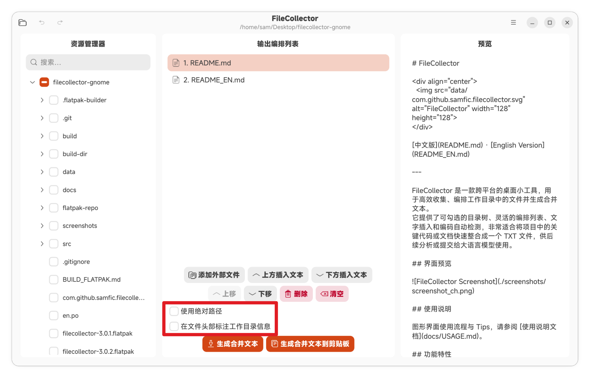

### 步骤 5：导出合并 TXT 文本

完成编排后，可选择以下任一方式输出合并内容：

- **导出到文件**：将合并后的 TXT 文本保存到您指定的路径，便于归档、分享或后续处理。
- **复制到剪贴板**：直接将合并内容写入系统剪贴板，方便立即粘贴到其他应用（例如与大语言模型对话窗口）。

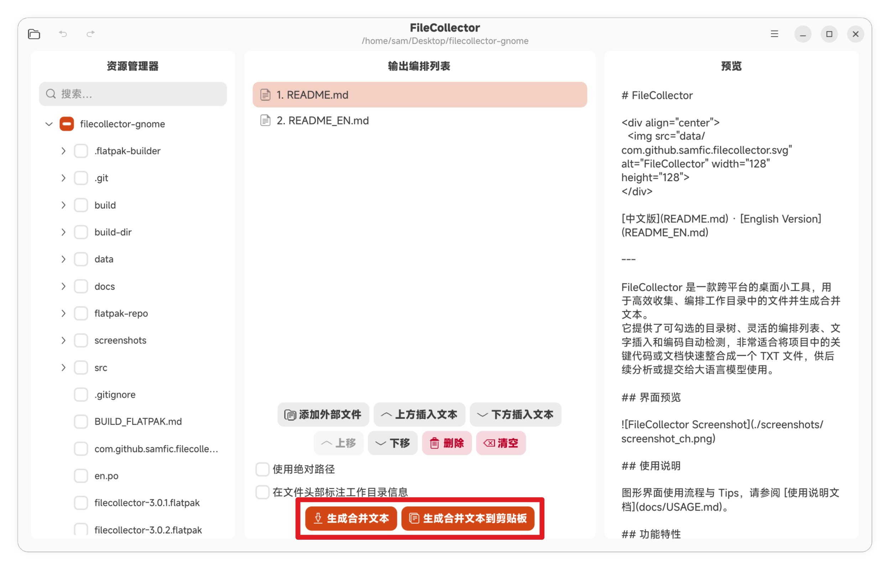

## 使用 Tips

### 1. 快速预览文件内容

点击资源管理器或输出编排列表中的任意文本文件，即可在最右侧的预览区即时查看其内容，无需借助外部编辑器。

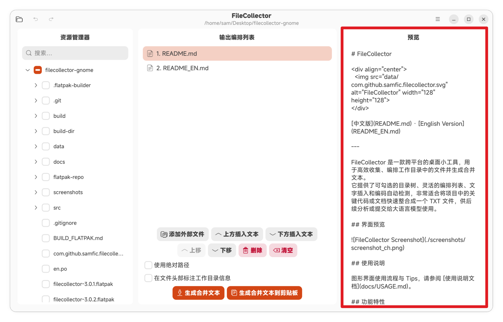

### 2. 自定义面板布局

资源管理器区、输出编排列表区与预览区之间的分割线均支持拖拽。您可以根据当前任务自由调整各区域的大小。

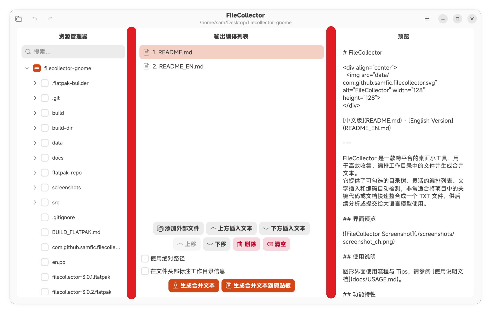

### 3. 常用语管理

通过右上角菜单的「常用语」入口，可打开常用语管理界面：

- 单击某一条常用语，可对其内容进行编辑与维护。
- 在使用「上方插入文本」或「下方插入文本」功能时，可通过常用语选择器一键插入预定义的常用语（例如固定格式的注释、问题描述模板等）。

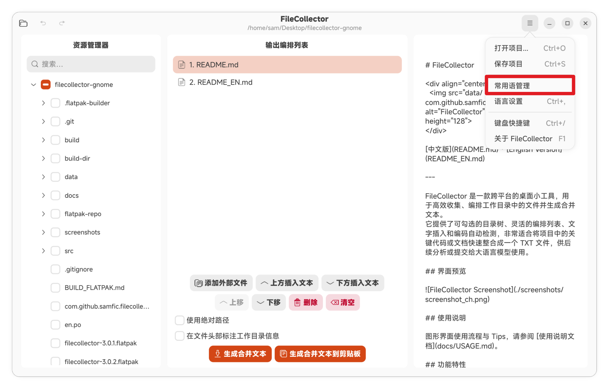

### 4. 项目的保存与打开

通过右上角菜单可保存或打开项目文件。保存的项目会同时记录工作区路径、文件勾选状态与输出编排列表内容，便于：

- 下次启动时一键恢复到之前的工作状态。
- 与团队成员共享编排结果，实现协作交接。

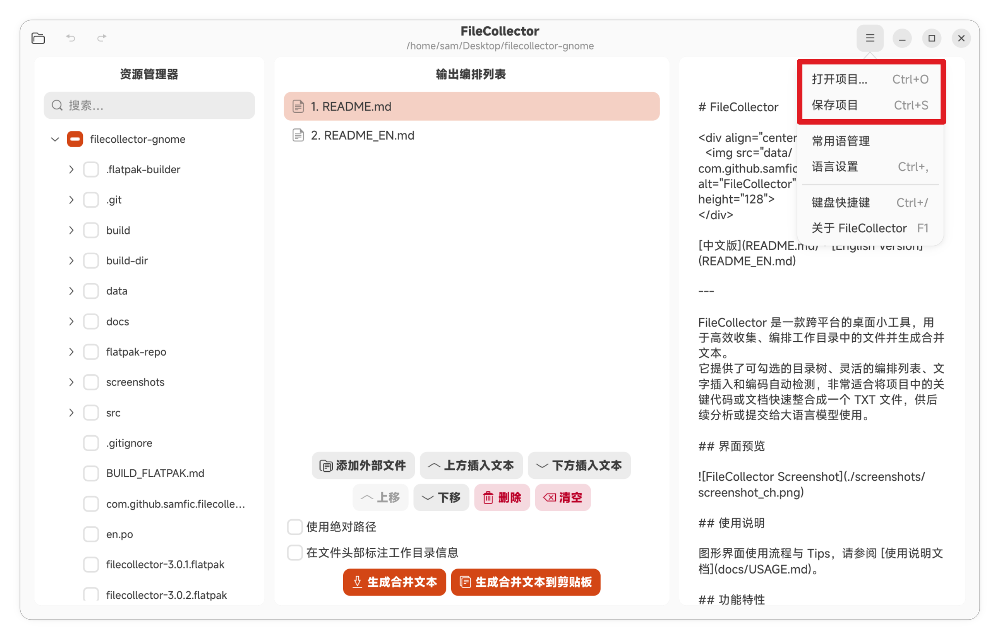

### 5. 编辑已插入的文本

双击输出编排列表中以「文本」形式插入的项，即可重新编辑其内容。该功能便于在编排过程中对已添加的注释或说明进行调整，无需先删除再重新插入。

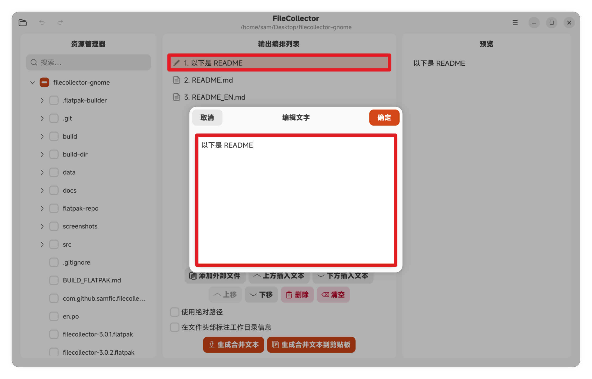

### 6. 文件搜索

选定工作目录后，可在左侧资源管理器顶部的搜索框中按文件名快速搜索。该功能在大型项目中尤为实用，能够帮助您迅速定位目标文件，而无需手动展开多层目录。

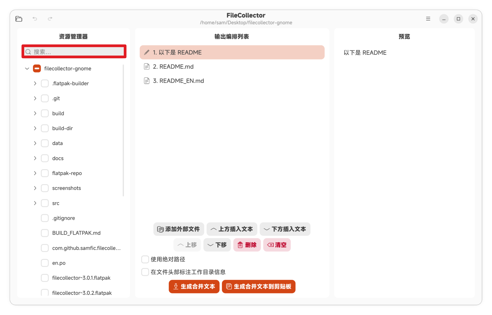
