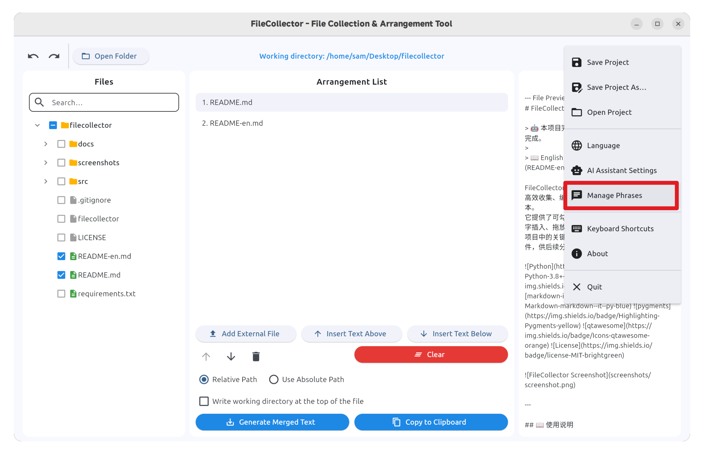
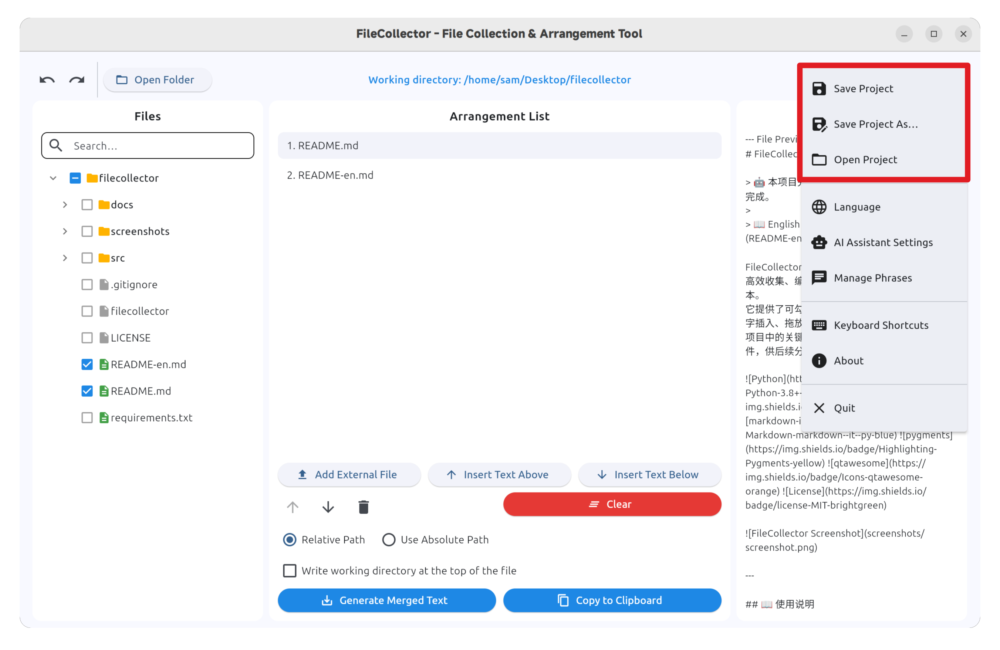
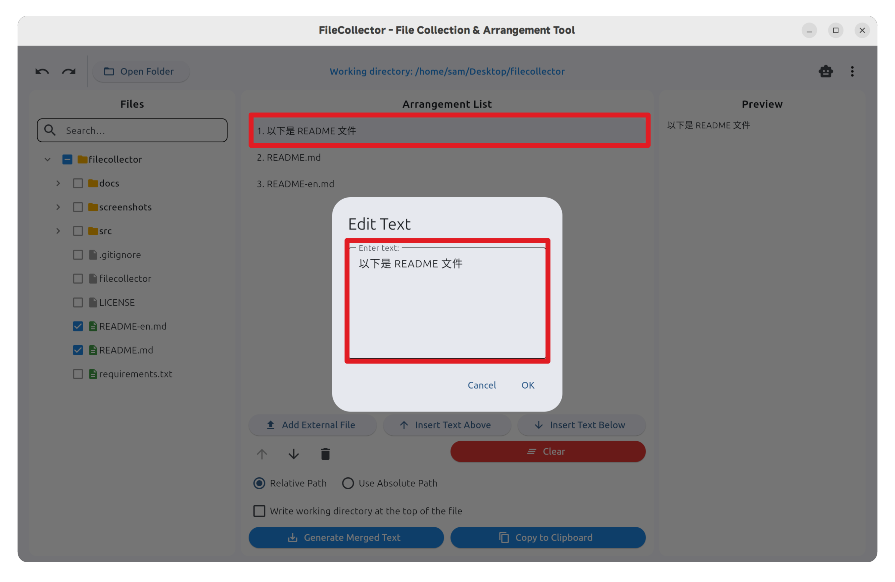
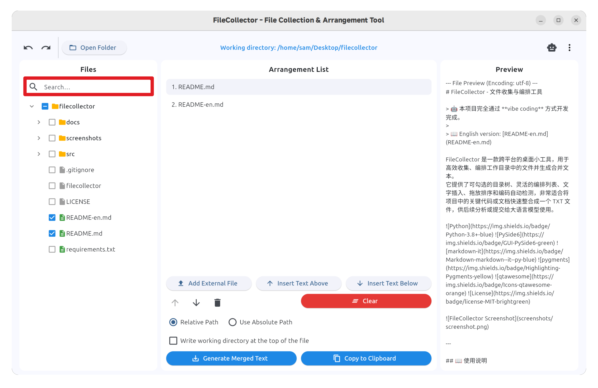

# FileCollector Usage Guide

This document provides a detailed walkthrough of the FileCollector graphical interface, helping you quickly master the core features: file selection, organization, custom text insertion, and merged text export.

> **Note**: For project overview and build instructions, please refer to [README_EN.md](../README_EN.md). This guide focuses solely on the GUI workflow.

> The interface illustrations in this document are from the GNOME version.

## Table of Contents

- [Workflow](#workflow)
  - [Step 1: Open a Working Directory](#step-1-open-a-working-directory)
  - [Step 2: Select Files to Include](#step-2-select-files-to-include)
  - [Step 3: Adjust the Output Organization List](#step-3-adjust-the-output-organization-list)
  - [Step 4: Preview the Merged Text Output Format](#step-4-preview-the-merged-text-output-format)
  - [Step 5: Export the Merged TXT](#step-5-export-the-merged-txt)
- [Usage Tips](#usage-tips)
  - [1. Quick File Preview](#1-quick-file-preview)
  - [2. Common Phrase Management](#2-common-phrase-management)
  - [3. Customizable Panel Layout](#3-customizable-panel-layout)
  - [4. Save and Open Projects](#4-save-and-open-projects)
  - [5. Edit Inserted Text Items](#5-edit-inserted-text-items)
  - [6. File Search](#6-file-search)

## Workflow

### Step 1: Open a Working Directory

Click the **Open Working Directory** button in the top-left corner and select your project root from the directory picker. This directory serves as the root scope for all subsequent operations — relative path calculations, file search, and selection behaviors are all based on it.

### Step 2: Select Files to Include

Browse the directory tree in the left-side file explorer and check the files you want to include in the merged text:

- **Checkbox**: Click the checkbox to the left of a folder to select or deselect all files within that folder in one go.
- **Arrow**: Click the arrow to the left of a folder to expand or collapse its sub-levels, making it easier to navigate large projects.

Selected files are immediately synced to the **Output Organization List** on the right.

### Step 3: Adjust the Output Organization List

Click any item in the output organization list, then use the action buttons below or the corresponding keyboard shortcuts to operate on it:

- **Move**: Move the selected item up or down within the list to adjust the merge order.
- **Insert Text**: Insert a custom text block **above** or **below** the selected item — useful for adding separators, problem descriptions, or comments between files.
- **Delete**: Remove the selected item from the list.
- **Clear**: Wipe the entire organization list and start over.

With these operations, you can flexibly structure the layout and ordering of the final merged text.

### Step 4: Preview the Merged Text Output Format

The merged text is integrated strictly in the order defined by the output organization list, following these path-identification rules:

- **Files inside the working directory**: The file path is shown above the file body. Use the option at the bottom of the window to switch between **absolute path** and **relative path (relative to the working directory)**.
- **Files outside the working directory**: Always identified by their absolute path for unambiguous reference.
- **Working-directory header info**: When the **absolute path** option is disabled, you can choose to prepend the working directory's path information at the top of each file, making it easier to locate the source when reading the merged text.

### Step 5: Export the Merged TXT

Once your organization is complete, you can output the merged content using either of the following methods:

- **Export to file**: Save the merged TXT to a path of your choice for archiving, sharing, or further processing.
- **Copy to clipboard**: Write the merged content directly to the system clipboard so you can paste it into another application (e.g., a chat window with a large language model).

## Usage Tips

### 1. Quick File Preview

Click any text file in either the file explorer or the output organization list to instantly view its content in the preview area on the far right — no external editor required.

### 2. Common Phrase Management

Access the **Common Phrases** manager from the top-right menu:

- Click any phrase in the list to edit and maintain its content.
- When using the **Insert Text Above** or **Insert Text Below** actions, the phrase picker lets you quickly insert a predefined phrase (e.g., a fixed comment format, a problem description template, etc.) with a single click.

### 3. Save and Open Projects

Use the top-right menu to save or open project files. A saved project records the working directory, file selection state, and output organization list, enabling you to:

- Restore the previous work state with a single click on next launch.
- Share the organization result with teammates for collaborative handoff.

### 4. Edit Inserted Text Items

Double-click any text item that has been inserted into the output organization list to edit its content. This is handy for tweaking comments or notes already added during organization — no need to delete and re-insert.

### 5. File Search

After selecting a working directory, use the search box at the top of the left-side file explorer to quickly find files by name. This is especially useful in large projects, allowing you to locate target files without manually expanding multiple levels of directories.

